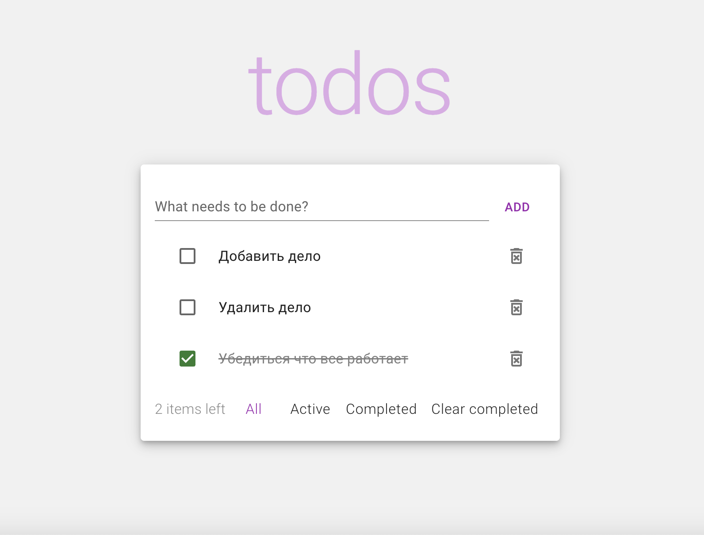

# Todos app

[View the application](https://petr-romantsov.github.io/test-todos/)



ToDo application that allows you to manage your current task list.
Tasks can be added, deleted, and marked as completed. The following filters are also available:

- All tasks
- Active tasks only
- Completed tasks only

Using the “Clear completed” button, you can remove completed tasks from the list.

---

### Tools :


### Getting started

To get more familiar with the application code, clone the repository from the `dev` branch and perform the necessary actions.

Install the dependencies

```
npm install
```

To run the application in development mode, execute the command

```
npm run dev
```

To run the tests, execute

```
npm run test
```

To create a build of the application, execute the command:

```
npm run build
```

### Link

Link to view the project: https://petr-romantsov.github.io/test-todos/
